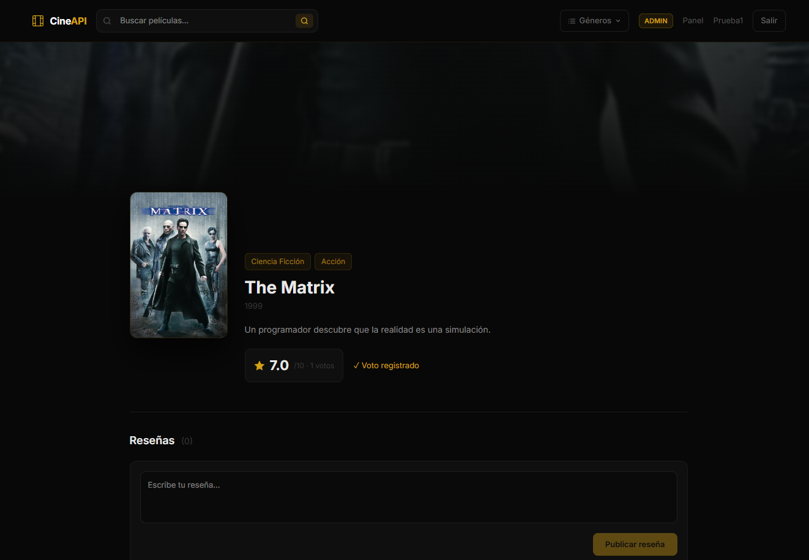

# CineAPI — Frontend

> Tu universo cinematográfico. Frontend Angular 22 para la plataforma CineAPI.



---

## Sobre el proyecto

CineAPI Frontend es la interfaz web de la plataforma **CineAPI**, un catálogo de películas con sistema de votación y reseñas. Está construido con **Angular 22** y consume la API REST del [backend CineAPI](https://github.com/EstebanMM13/CineAPI) desarrollado con Spring Cloud.

### Funcionalidades

- Búsqueda de películas en tiempo real
- Filtrado por género desde la navbar
- Detalle de película con descripción, rating y géneros
- Sistema de votación (1–10) para usuarios autenticados
- Reseñas por película — crear, leer y eliminar
- Autenticación con JWT (login y registro)
- Panel de administración para gestionar películas, géneros y usuarios
- Diseño premium dark con acento dorado

---

## Stack

| Tecnología | Versión |
|---|---|
| Angular | 22 |
| TypeScript | 6 |
| Tailwind CSS | 4 |
| RxJS | 7.8 |
| zone.js | 0.16 |

---

## Requisitos

- Node.js 20+
- npm 11+
- El [backend CineAPI](https://github.com/EstebanMM13/CineAPI) corriendo en `localhost:8060`

---

## Instalación y arranque

```bash
# Clonar el repo
git clone https://github.com/EstebanMM13/CineAPI-Frontend.git
cd CineAPI-Frontend

# Instalar dependencias
npm install

# Arrancar en desarrollo
npm start
```

La app estará disponible en `http://localhost:4200`.

---

## Variables de entorno

El archivo `src/environments/environment.ts` contiene la URL base de la API:

```typescript
export const environment = {
  apiUrl: 'http://localhost:8060/api/v1'
};
```

Cambia `apiUrl` si el backend corre en otro puerto o host.

---

## Scripts

| Comando | Descripción |
|---|---|
| `npm start` | Servidor de desarrollo |
| `npm run build` | Build de producción |
| `npm run watch` | Build en modo watch |

---

## Estructura del proyecto

```
src/
├── app/
│   ├── core/
│   │   ├── guards/        # Auth y admin guards
│   │   ├── interceptors/  # JWT interceptor
│   │   ├── models/        # Interfaces TypeScript
│   │   └── services/      # Movie, Genre, Review, Auth
│   ├── features/
│   │   ├── admin/         # Panel de administración
│   │   ├── auth/          # Login y registro
│   │   ├── home/          # Catálogo principal
│   │   └── movie-detail/  # Detalle de película
│   └── shared/
│       ├── movie-card/    # Tarjeta de película
│       ├── navbar/        # Navegación principal
│       └── pagination/    # Paginación
├── environments/
└── styles.css
```

---

## Backend relacionado

Este frontend está diseñado para funcionar con **CineAPI**, un backend de microservicios con Spring Cloud (Gateway, Eureka, Config Server).

→ [Ver repositorio del backend](https://github.com/EstebanMM13/CineAPI)
